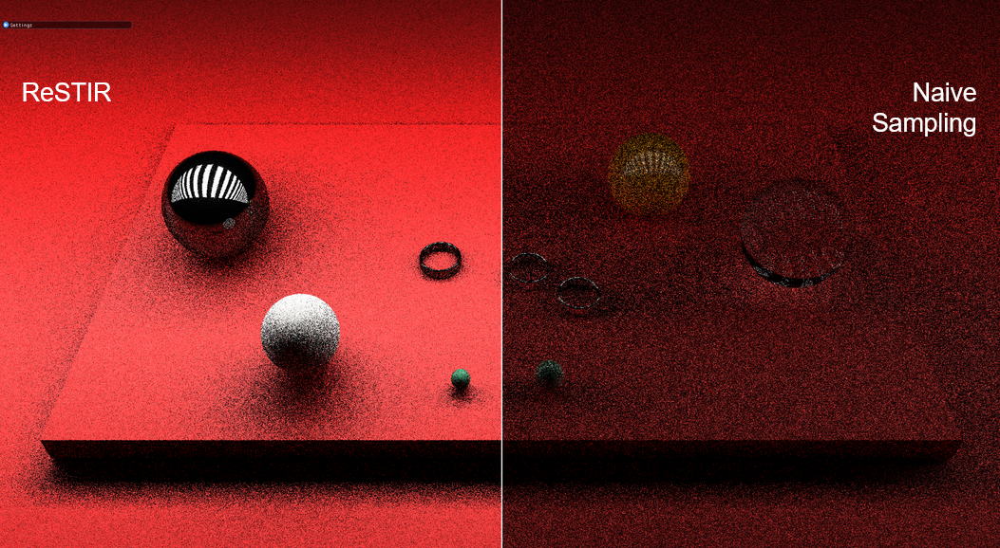

# A ReSTIR implementation

This project uses a premade OpenGL pathtracer with modifications for direct light sample reuse.
It was done for the course CSCI 2240 Advanced Computer Graphics at Brown University. 

### Group: RizzSTIR
### Members: Arin Idhant, Trey Wiedmann, Evan Mickelson
### [Paper Link](https://research.nvidia.com/publication/2020-07_spatiotemporal-reservoir-resampling-real-time-ray-tracing-dynamic-direct)
The paper's authors are
- Benedikt Bitterli 
- Chris Wyman
- Matt Pharr
- Peter Shirley 
- Aaron Lefohn
- Wojciech Jarosz 

Honorary papers that were also helpful include [ReSTIR GI](https://research.nvidia.com/publication/2021-06_restir-gi-path-resampling-real-time-path-tracing) and [Generalized Resampled Importance Sampling](https://research.nvidia.com/publication/2022-07_generalized-resampled-importance-sampling-foundations-restir)

Other sources
- [Gentle introduction](http://intro-to-restir.cwyman.org/)
- [Understanding the math behind ReSTIR](https://agraphicsguynotes.com/posts/understanding_the_math_behind_restir_di/)

Images

In this image, there are 2 blank, non emissive lights outside the cornell box. On the left, ReSTIR is used, on the right, it is not.
![[./screenshots/restir/cornell_distractor_lights.png]]

# Hyperion scene

In the following three images, on the left is our ReSTIR output, and the right is without. All using one super sample

Here is a denoised image.

Here is a scene with two thousand lights.  

On the left is no ReSTIR, the middle is importance sampling, and the right is importance sampling with spatial and temporal reservoir sharing (all of ReSTIR). 

Here is a link to [our presentation](https://docs.google.com/presentation/d/1OA_NKY1Eo5WP1C1tcTaC8LcgJjIRJX5aoFfvYs4lwVg/edit?usp=sharing)

Of note, our temporal does not work as the paper describes. We naively reuse samples from previous frames instead of transforming it based on camera locations. We unfortuantely could not get this aspect working perfectly on time, but otherwise the program functions as we understand it from the paper. 

